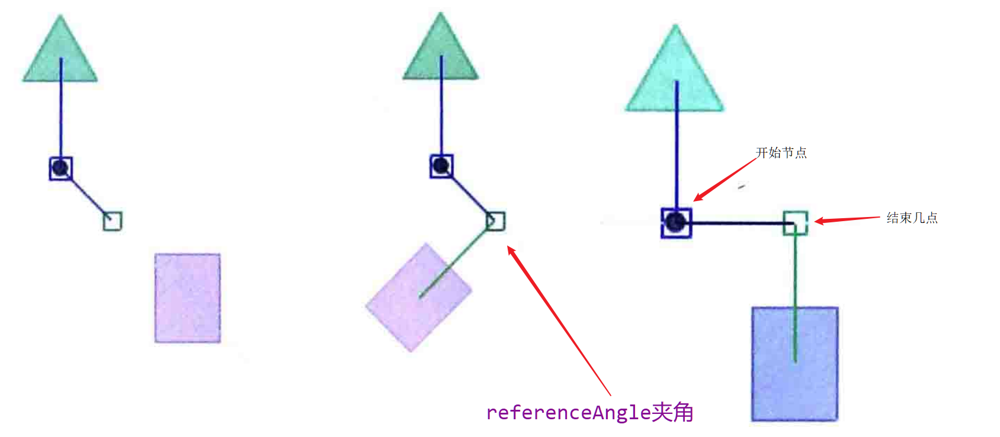
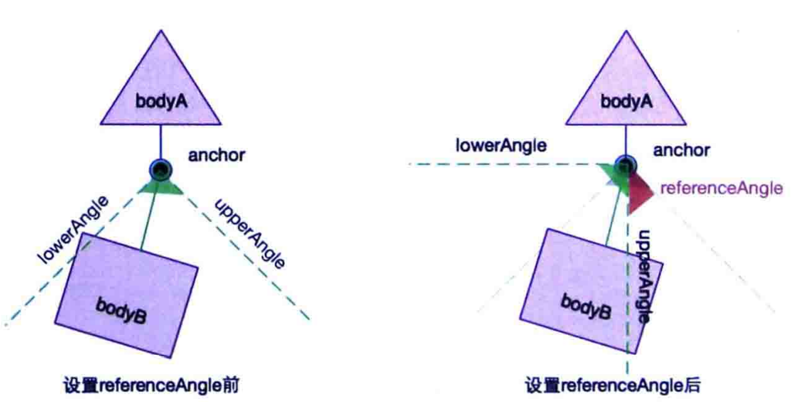
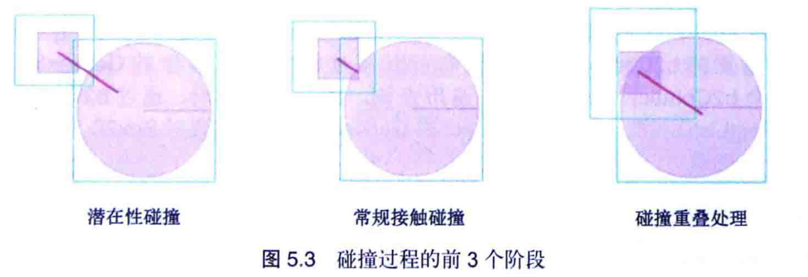
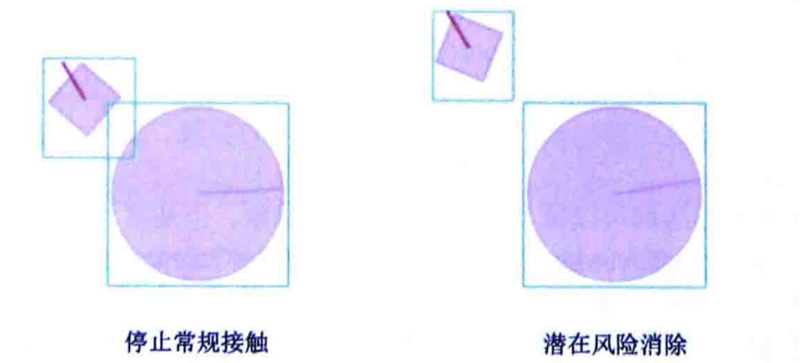
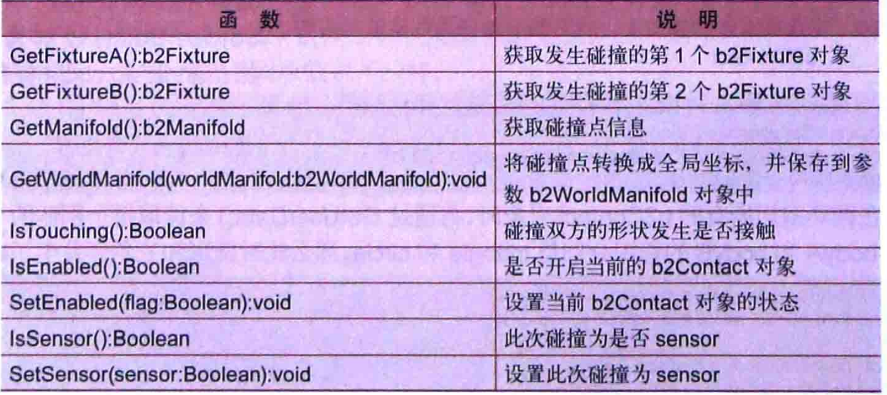
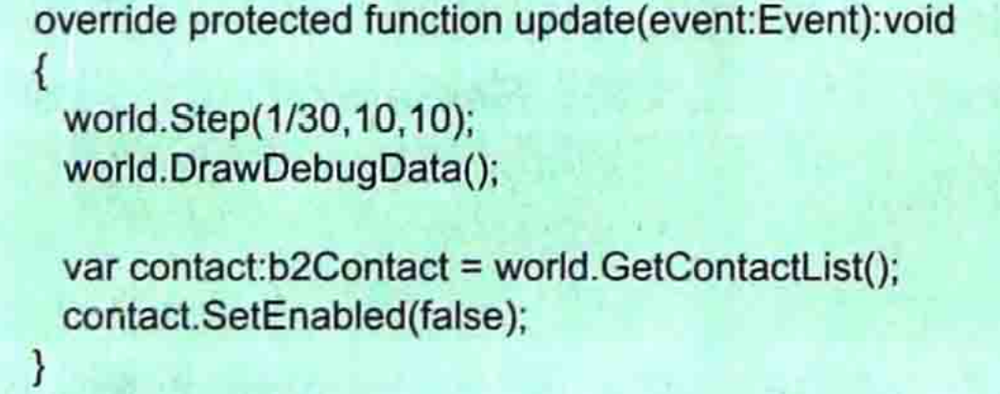
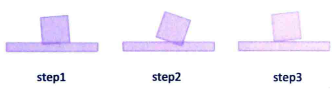
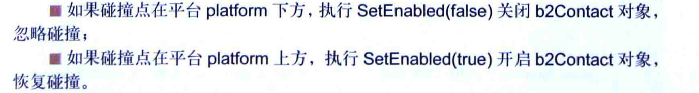
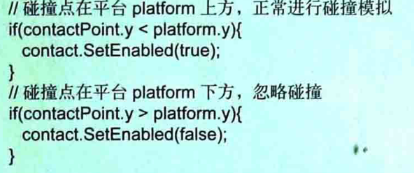

# Box 2d

- [Box 2d](#box-2d)
  * [git](#git)
  * [初始化box2d](#---box2d)
    + [参数](#--)
      - [积分步](#---)
    + [Api](#api)
    + [世界刷新](#----)
    + [角度转换](#----)
  * [力](#-)
    + [ApplyForce](#applyforce)
    + [ApplyMpulse](#applympulse)
    + [setLineVelocity](#setlinevelocity)
  * [多边形](#---)
  * [存储数据](#----)
  * [移動鼠標（这个demo没有弄好,没写出来）](#-------demo----------)
  * [自定义重力](#-----)
  * [监听撞击](#----)
  * [像素](#--)
  * [Fixture](#fixture)
  * [认识](#--)
  * [（二）](#---)
  * [关节](#--)
    + [DistanceJointDef](#distancejointdef)
  * [马达关节](#----)
  * [计算路径](#----)
    + [计算刚体位置](#------)
    + [最大高度](#----)
    + [计算初始速度](#------)
  * [刚体的Box2D缩放](#---box2d--)
  * [获取碰撞点](#-----)
  * [无阻尼匀速运动](#-------)
  * [isSensor属性创建感应区域](#issensor--------)
  * [碰撞进行分类](#------)
  * [Box2DDebugRenderer](#box2ddebugrenderer)
  * [浮力效果](#----)
  * [镜头跟随](#----)
  * [刚体碰撞处理函数](#--------)
  * [刚体碰撞检测](#------)
- [关节](#---1)
    + [关节的属性](#-----)
  * [鼠标关节](#----)
  * [PrismaticJointDef](#prismaticjointdef)
    + [夹角的确定](#-----)
    + [使用场景](#----)
    + [线性关节](#----)
  * [RevoluteJoint(旋转关节)](#revolutejoint------)
    + [作用](#--)
  * [DistanceJoint](#distancejoint)
  * [WeldJoint粘贴关节](#weldjoint----)
    + [使用](#--)
  * [滑轮节点](#----)
  * [柔体实现](#----)
  * [补充](#--)
  * [根据局部坐标得到世界坐标](#------------)
  * [摩檫力和阻尼区别](#--------)
  * [销毁](#--)
  * [設置位置](#----)
- [碰撞](#--)
  * [什么是碰撞](#-----)
    + [ContactList()获取列表](#contactlist------)
    + [ContactListener](#contactlistener)
  * [FixtureA和FixtureB](#fixturea-fixtureb)
  * [getManiFold()](#getmanifold--)
  * [isTouching()](#istouching--)
  * [setEnable()和IsEnable()](#setenable---isenable--)
    + [step的执行过程](#step-----)
  * [setSensor()](#setsensor--)
    + [setFriction](#setfriction)
    + [setTangenSpeed](#settangenspeed)
  * [碰撞侦听器](#-----)
  * [参数](#---1)
  * [游戏碰撞](#----)
    + [万有引力](#----)
  * [撞击伤害](#----)
  * [单边](#--)
  * [碰撞粘贴](#----)

<small><i><a href='http://ecotrust-canada.github.io/markdown-toc/'>Table of contents generated with markdown-toc</a></i></small>


更加详细的看doc目录，正在完善，随后完善案例.

## git

```git
git init 
git add ./
git commit -m "提交"
git push origin master
```

## 初始化box2d

### 参数

#### 积分步

Box2D是由一些代码构成的积分器，积分器在离散点上做模拟物理运算，它将与游戏动画循环一同运行（时间步的作用）
物理的计算需要60帧

约束器，用于求解器解决模拟中的约束，一次一个，的那个约束会被求解，但是在求解一个的时候会耽误另一个。
处理办法：迭代多次   box2D建议是10次
少的迭代会增加性能降低精度      一个时间步遍历10次约束。

### Api

公差保证其工作  Box2D可以处理0.1到10米之间的移动物体

- body创建过程

```
BodyDef bodyDef = new BodyDef();
bodyDef.type = this.type;
bodyDef.position.set(position.x,position.y);
Body body = Constant.world.createBody(bodyDef);
if (shape == null){
    PolygonShape polygonShape = new PolygonShape();
    polygonShape.setAsBox(width, height);
    shape = polygonShape;
}
FixtureDef fixtureDef = new FixtureDef();
fixtureDef.shape = shape;
if (categoryBits != -1){
    fixtureDef.filter.categoryBits = categoryBits;
}
if (maskBits != -1) {
    fixtureDef.filter.maskBits = maskBits;
}
body.createFixture(fixtureDef);
shape.dispose();
```

### 世界刷新

```
Constant.world.step(1/60f, 6, 2);
Constant.renderer.render(Constant.world,Constant.combined);
```

### 角度转换

```
float degrees = (float) Math.toDegrees(body.getAngle());
```

如果和精灵绑定，如果需要旋转，需要设置旋转的位置中心点。

## 力

### ApplyForce

ApplyForce方法会在刚体上施加力

F = ma   使得物体存在加速度

### ApplyMpulse

不会产生力，直接影响速度   会使得速度叠加，产生新速度

### setLineVelocity

它会将速度变为当前速度。调用之前需要wakeup()


```
//给一个力     f = ma
if (Gdx.input.isKeyPressed(Input.Keys.UP)) {
    body.applyForce(new Vector2(100,0), body.getWorldCenter(),true);
}

//叠加
if (Gdx.input.isKeyPressed(Input.Keys.DOWN)) {
    body.applyLinearImpulse(new Vector2(-100,0), body.getWorldCenter(),true);
}

//设置
if (Gdx.input.isKeyPressed(Input.Keys.LEFT)) {
    body.setLinearVelocity(new Vector2(-100,0));
}
```

## 多边形

- 组合  通过多个组合出一个完整的

- 原生  

```
PolygonShape shape = new PolygonShape();
Vector2 [] vertices = new Vector2[4];
vertices[0] = new Vector2();
vertices[0].set(50, 50);
vertices[1] = new Vector2();
vertices[1].set(200, 50);
vertices[2] = new Vector2();
vertices[2].set(100, 200);
vertices[3] = new Vector2();
vertices[3].set(200, 200);
shape.set(vertices);
```

对于凹多边形会出现错误。

b2Separator但是java框架並麽有找到。 ……

## 存储数据

```
BodyDef bodyDef1 = new BodyDef();
bodyDef1.position.set(230, 130);//记得米和像素的转换关系
//2.Box2D世界工厂更具需求创建createBody()生产刚体
body=Constant.world.createBody(bodyDef1);

FixtureDef shapeRequest1 = new FixtureDef();
shapeRequest1.density = 3;
shapeRequest1.friction = 0.3F;
shapeRequest1.restitution = 0.2F;

PolygonShape shape1 = new PolygonShape();
shape1.setAsBox(50,50);

FixtureDef bgDef1 = new FixtureDef();
bgDef1.shape = shape1;
body.createFixture(bgDef1);

Image image = new Image(new Texture("1.png"));
image.setSize(100,100);

body.setUserData(image);
```

将数据存储在body里面，需要属于到时候在将值取出来。一般可以将纹理存储在刚体中，使用的时候从刚体中取出，然后渲染。

## 移動鼠標（这个demo没有弄好,没写出来）

MouseJointDef def = new MouseJointDef();
def.bodyA :一个
def.bodyB :另一个
def.maxForce : 限制鼠标关节上的最大的力 这里通常需要乘以刚体的
质量multiplier * mass * gravity

## 自定义重力

重力是一个向下的力，但是热气球可以在空中。

实现方法有两种：一、加减法抵消重力；二、重置重力。下面我们来详细一下这两种方法。简单说就是将力消除掉。

有方向  有大小的力  重力 = 质量 * 重力加速度

得到身体的总质量。 * @返回质量，通常以千克（kg）为单位。
body.getMass();

//获取身体的质量数据。 * @返回包含身体质量，惯性和中心的结构
body.getMassData();

```
public class MassData {
	/** The mass of the shape, usually in kilograms. **/
	public float mass;

	/** The position of the shape's centroid relative to the shape's origin. **/
	public final Vector2 center = new Vector2();

	/** The rotational inertia of the shape about the local origin. **/
	public float I;  //惯性
}

```

给重力一个反作用力

```
body.ApplyForce(new b2Vec2(0, -10*body.GetMass()),body.GetWorldCenter());
```

Box2D中的Dynamics包下有一个b2Island类，类中有一个Solve方法，这方法通过gravity形参对刚体进行
重力模拟，代码如下：


能不能解释下getWorldCenter与getWorldPoint的区别?????


## 监听撞击

```
分类 和 掩码

分类： 分类我是谁
掩码： 我撞击谁

public class WorldContactListener implements ContactListener{
   @Override
    public void beginContact(Contact contact) {
        Fixture fixtureA = contact.getFixtureA();
        Fixture fixtureB = contact.getFixtureB();
        if (fixtureA.getFilterData().categoryBits == Constant.PILL_BIT ||
                fixtureB.getFilterData().categoryBits == Constant.PILL_BIT) {
            // pill
            if (fixtureA.getFilterData().categoryBits == Constant.PLAYER_BIT) {
            }else{
            }
        }
    }
    @Override
    public void endContact(Contact contact) {
    }
    @Override
    public void preSolve(Contact contact, Manifold oldManifold) {
    }
    @Override
    public void postSolve(Contact contact, ContactImpulse impulse) {
    }
}
```

存储数据

``` 
body.setUserData(object);
```

获取数据

```
Object userData = body.getUserData();
```

```
float density = -1;     密度
float friction = -1;    摩擦力
float restitution = -1; 反馈
```

## 像素

Box2D使用MKS单位和弧度表示角度，通常使用像素作为单位的，只需要使用openGl视口缩放世界缩放的屏幕空间。

```
float lowerX=-25.0f, upperX=25.0f, lowerY=-5.0f, upperY=25.0f;
gluOrtho2D(lowerX, upperX, lowerY, upperY);
```

如果游戏为像素，那么及家具从像素转换为米，同时，将Box2D接收到的值从米转换为像素。

```java
xMeters=0.02f*xPixels;yMeters=0.02f*yPixels;
xPixels=50.0华氏度 *xMeters;yPixels=50.0华氏度 *yMeters;
```

## Fixture

```
body.createFixture(shape, 1.0f);
body.createFixture (FixtureDef def)
```


## 认识

Box2d是通过b2AABB表示的
Box2D中的大小是通过设置两个对角顶点upperBound和lowerBound实现的
对于静止不动的就设置睡着。

```
创建世界
```

## （二）

Box 2D计量单位米    

模拟的时长     碰撞后检测的运行次数
```
Constant.world.step(1/60f, 6, 2);
Constant.renderer.render(Constant.world,Constant.combined);
```

刚体创建可以看作是一个工厂，创建步骤：
- 创建刚体，需要提供位置   角度
- 定义刚体形状
    a) density：质量
    b) friction：表面摩擦力
    c) restitution：表面张力，这个值越大，刚体越硬
    d) SetAsBox：设置刚体为矩形
    
---------------
步骤 ：

- 创建世界

那条线可以可以标示圆形刚体的角度，灰色表示刚体静止，不参与Box2D模拟计算，红色表示刚体
为运动的，要进行物理模拟计算，专业分类可以节省CPU开支。


## 关节

创建实例

```
Body body1 = createBody(600);
Body body2 = createBody(0);

//关节
WeldJointDef def = new WeldJointDef();
def.collideConnected = false;
def.initialize(body1,body2,new Vector2(0,0));
Constant.world.createJoint(def);
```

必须要是他的子类

```
public Joint createJoint (JointDef def) {
long jointAddr = createProperJoint(def);
Joint joint = null;
if (def.type == JointType.DistanceJoint) joint = new DistanceJoint(this, jointAddr);
if (def.type == JointType.FrictionJoint) joint = new FrictionJoint(this, jointAddr);
if (def.type == JointType.GearJoint) joint = new GearJoint(this, jointAddr, ((GearJointDef) def).joint1, ((GearJointDef) def).joint2);
if (def.type == JointType.MotorJoint) joint = new MotorJoint(this, jointAddr);
if (def.type == JointType.MouseJoint) joint = new MouseJoint(this, jointAddr);
if (def.type == JointType.PrismaticJoint) joint = new PrismaticJoint(this, jointAddr);
if (def.type == JointType.PulleyJoint) joint = new PulleyJoint(this, jointAddr);
if (def.type == JointType.RevoluteJoint) joint = new RevoluteJoint(this, jointAddr);
if (def.type == JointType.RopeJoint) joint = new RopeJoint(this, jointAddr);
if (def.type == JointType.WeldJoint) joint = new WeldJoint(this, jointAddr);
if (def.type == JointType.WheelJoint) joint = new WheelJoint(this, jointAddr);
if (joint == null) throw new GdxRuntimeException("Unknown joint type: " + def.type); 
```

两个刚体保持一致,做某种运动   


### DistanceJointDef

```
Body body1 = createBody(800);
Body body2 = createBody(188);
DistanceJointDef  jointDef = new DistanceJointDef();
jointDef.bodyA = body1;
jointDef.bodyB = body2;
jointDef.initialize(body1,body2,new Vector2(Constant.width/2-100,500),new Vector2(Constant.width/2,500));
```

这个可以用自行车的前后轮胎进行类比


## 马达关节


## 计算路径

提前知道刚体运动的路径

 a)刚体的位置,n个timestep后,刚体的位置,用于小鸟的轨迹.
 b)计算刚体的最大高度,初始速度v0飞出后,可以到达的最大高度;
 c)计算刚体到达某个位置需要的初始速度.


### 计算刚体位置

s = 1/2 * a * t * t;

实际

数列的总和

间距  1/2 * n * (a1 + an)

1/2 * n (a1 + a1 + an)  = 


### 最大高度

u = u0 + at

### 计算初始速度


## 刚体的Box2D缩放

更改形状

```
//得到刚体,然后重新设置形状
PolygonShape shape = (PolygonShape) body.getFixtureList().get(0).getShape();
Vector2[] vertices1 = new Vector2[3];
vertices1[0] = new Vector2(20, 0);
vertices1[1] = new Vector2(20, 40);
vertices1[2] = new Vector2(0, 0);
polygonShape.set(vertices1);
```

## 获取碰撞点

得到碰撞点的位置   通过b2Contact对象  得到碰撞信息

GetManifold()获取相对于刚体的碰撞点本地坐标
GetWorldManifold()舞台碰撞点的全局坐标


```
WorldManifold worldManifold = contact.getWorldManifold();
Vector2 point = worldManifold.getPoints()[0];
System.out.println(point.x+"-----------"+point.y);
```

BeginContact：当碰撞发生时触发该方法
EndContact：当碰撞结束时触发该方法

```
灯具开始时调用
public void beginContact(Contact contact) {
   //得到stage的坐标
    WorldManifold worldManifold = contact.getWorldManifold();
    Vector2 point = worldManifold.getPoints()[0];
    System.out.println(point.x+"-----------"+point.y);
}

停止时调用
public void endContact(Contact contact) {

}

contact更新之后执行的方法  
public void preSolve(Contact contact, Manifold oldManifold) {
    //得到stage的坐标
    WorldManifold worldManifold = contact.getWorldManifold();
    Vector2 point = worldManifold.getPoints()[0];
    System.out.println(point.x+"-----------"+point.y);
}

@Override
public void postSolve(Contact contact, ContactImpulse impulse) {
}
```

Contact:管理两个形状之间的接触。每个重叠AABB都有一个触点,因此可能存在没有接触点的接触对象

## 无阻尼匀速运动

Box2D物理引擎默认情况下，对世界b2World里的刚体都是模拟自由落体运动，并且因为摩擦力的影响，
刚体会慢慢的停下来(在物理学上也叫做有阻尼运动)

world = world = new b2World(new b2Vec2(0,0), true);  无重力   
给一个反作用的力  消除重力

SetLinearVelocity()设置速度 ，但是存在阻力

不断的调整速度大小  不包括方向


## isSensor属性创建感应区域

设置刚体是不是参与物理模拟。  

- false (default)  碰撞后进行反弹 或者 变向运动
- truw 只会进行碰撞检测，并不会进行碰撞后的物理运动。

比如下落，并不会撞击了地面就停止，而是撞击了地面会检测到，然后穿过去  只检测不执行

## 碰撞进行分类

Filter是”过滤”的意思
FilterData可以简单的理解成用来过滤碰撞刚体(比如接下来哦我么要实现的矩形只与矩形刚体碰撞，圆形只与
圆形刚体碰撞)。
FilterData有3个属性：groupIndex、categoryBits和maskBits

groupIndex : 刚体属于哪一个组   只与同组的发生碰撞
categoryBits ： 必须是2的 n次方

maskBits：掩码就是我需要去注意谁

## Box2DDebugRenderer

Box2DebugRenderer   这个类除了不绘制AABB,其他都绘制。

## 浮力效果

刚开始接触的时候给一个浮力，占用的体力越大，浮力就越大，还会出现旋转的现象。

ApplyForce  No 

BuoyancyController


···有空补···

## 镜头跟随

方式一：

一个物体最左边，相机，背景不动，到达屏幕中央，相机开始跟随运动

方式二：

蚂蚁走到桌子中央的时候，桌子开始左边移动

## 刚体碰撞处理函数

```
Fixture fixtureA = contact.getFixtureA();
Fixture fixtureB = contact.getFixtureB();
short categoryBits = fixtureA.getFilterData().categoryBits;
short categoryBits1 = fixtureB.getFilterData().categoryBits;
if (categoryBits == Constant.BUTT_BIT){
    if (categoryBits1 == Constant.BLACK_BIT) {
        fixtureA.getBody().setLinearVelocity(0, -71);
    }else if (categoryBits1 == Constant.BUTTOM_BIT){
        fixtureA.getBody().setLinearVelocity(0, 71);
    }
}else if (categoryBits1 == Constant.BUTT_BIT){
    if (categoryBits == Constant.BLACK_BIT) {
        fixtureB.getBody().setLinearVelocity(0, -71);
    }else if (categoryBits == Constant.BUTTOM_BIT){
        fixtureB.getBody().setLinearVelocity(0, 71);
    }
}
```

我们并不知道对方是谁，谁是我，需要不停的判断，所有可以自定义外部函数

修改源码，在body源码加入方法

```java
/**
 *  add myself kw
    */
interface Handler{
    public void beginContactHanlder();
}

private Handler handler;

public void setHandler(Handler handler) {
    this.handler = handler;
}

public void handler(){
    if (handler != null){
        handler.beginContactHanlder();
    }
}
```

 

## 刚体碰撞检测

Box2D中获取碰撞对象的方法有两种。

- 一个是通过world.GetContactList().bodyA和bodyB来获取碰撞双方；
- 另外一个是自定义Box2D.Dynamics下的b2ContactListener类，侦听碰撞后的事件，然后做进一步的处理。

```java
Array<Contact> contactList = Constant.world.getContactList();
System.out.println("====>>>>>");
Fixture fixtureA = contactList.get(0).getFixtureA();
Fixture fixtureB = contactList.get(0).getFixtureB();
```

# 关节

box2d会通过关节将两个刚体绑在一起，使得两个刚体运动在关节的作用下相互制约相互影响形成有规律的运动。
box2Joint的创建方法

- 创建def对象，通过设置属性进行创建

```java
RevoluteJointDef def = new RevoluteJointDef();
def.initialize(box2DImage,body1,new Vector2(10,100));
Constant.world.createJoint(def);
```

说明：Joint and JointDef不会直接创建，它们是虚拟的抽象类，作为父类代码的多态和重构。

属性：

- BodyA
- BodyB
- CollideConnected:表示关节链接的两个物体之间是否可以发生碰撞模拟，默认为false,不发生碰撞，可以穿透 

### 关节的属性

- enableMotor：是否开启马达属性  默认false
- motorSpeed：在刚体运懂情况下，可以到达的最大线速度和最大角速度。
- maxMotorTorque:关节可以施加最大的力。

这个过程中，刚体的角速度和线速度会一直增加，直到motorSpeed属性
另一个属性可以作为旋转摩檫力使用，设置motorspeed属性值为0，maxMotorTorque作用会阻止刚体在原来的状态，直到外力大于maxMotorToorque属性

弹簧属性：

- frequencyHz和damping属性，运行刚体在运动时偏离节点，偏移后会收到一个力，使得它可以回到原来的位置。所以这两个属性就会在影响它。
- frequencyHz:弹簧系统的震动频率，可以看作时弹簧的弹性系数，系数越大，回归的系数就越大。
- dempingRaio:刚体回归节点收到的阻尼，0~1，值越大，阻力越大。

不常使用的

- GetReactionForce()
- GetReactionTorque()

## 鼠标关节

和鼠标是有关联的，可以实现鼠标的拖拽

- bodyA:一个空刚体
- bodyB:另一个
- target:创建关节时，target时bodyB被拖动收到前置的本地锚点，bodyB可以绕着旋转，他是目标位置，
- maxForce:鼠标关节拖拽bodyB时，施加最大的作用力

## PrismaticJointDef

```java
vector2 axis = new Vector2(6, 0);
//            axis.nor();
//bodyA 固定转轴
//bodyB 运动的
//开始位置
//方向    axis的值，确定了从开始到结束的夹角
pjd.initialize(ground, body, new Vector2(0, 0), axis);

pjd.motorSpeed = 10.0f;
pjd.maxMotorForce = 10000.0f;
pjd.enableMotor = true;
pjd.lowerTranslation = 0;
pjd.upperTranslation = 20.0f;
pjd.enableLimit = true;
m_joint = (PrismaticJoint)world.createJoint(pjd);
```

### 夹角的确定

axis点和anchor的夹角，作用只的大小没有太大意义的。

内部做了许多的计算 模拟  所以值比较大容易造成抖动

解决方法：将axis直接做成夹角就可以了 axis.nor();转换为向量。
夹角与固定的保持不变，也就是bodyA保持相对不变，bodyA变化了，夹角也会随着变化。

上面主要对角度进行了控制，下来我们对他的范围也进行控制，axis指定了角度，然后按照角度会不断的延申，为了不超出去

- enablLimit:对刚体移动范围是否进行约束，默认为false,true就表示将范围限制在
  
    - lowerTranslation
    - upperTranlation
    

要求：upper大于lower

- referenceAngle：角度差距，他的用法使用三张图来看

  


### 使用场景

固定路径，比如一个人从桥的这一头走到下一头。

### 线性关节

LineJoint他是一个特殊的平行关节，他的特尔二叔之处就是可以绕着anchorB进行旋转。

## RevoluteJoint(旋转关节)

旋转关节，可以看作一个轴，绕着轴旋转的车轮，这个关节 也有限制，比如最大角度，还有夹角。其次还有一些其他的函数。



- 角速度：JointSpeed
- 关节的旋转角：JointAngle
- 当前关节的扭矩力：MotorTorque

通过限制，可以做成跷跷板

### 作用

可以在游戏里面作为车轮。

跷跷板

## DistanceJoint 

距离关节：包含两个节点，分别对应两个刚体，使得各自绕着各自的轴转动，这个两个的距离不变

## WeldJoint粘贴关节

将两个刚体，连接成一个刚体。这个节点就是将它们死死的连接在一起。两个刚体是一样的，但是受到节点限制，使得两个保持不变，看起来像一个整体，如果将节点删除，会将两个分开。分别各自的速度，角速度。


### 使用

那个一个圆旋转的游戏就可以使用它。

## 滑轮节点

滑轮作用：牵引负载   改变施加力  方向

## 柔体实现

weldJoint来实现


## 补充

获取局部点的世界速度。 *请注意，每次调用此方法时，都会返回相同的Vector2实例。

getLinearVelocityFromLocalPoint (Vector2 localPoint)

x y z 坐标，以刚体自身建立坐标系，刚体自身的方向位移

```
public int direction() {
    final float tolerance = 0.2f;
    if (getLocalVelocity().y < -tolerance) {
        return DIRECTION_BACKWARD;
    } else if (getLocalVelocity().y > tolerance) {
        return DIRECTION_FORWARD;
    } else {
        return DIRECTION_NONE;
    }
}
```

获取公差的方式：

- 获取局部点的世界速度。 *请注意，每次调用此方法时，都会返回相同的Vector2实例
- 给定世界向量，获取局部向量。 *请注意，每次调用此方法时，都会返回相同的Vector2实例。
    worldVector世界坐标中的向量，返回相应的局部向量。
- getLocalVector 给定世界向量求局部向量
  
```
 mBody.getLocalVector(mBody.getLinearVelocityFromLocalPoint(new Vector2(0, 0)));
```

## 根据局部坐标得到世界坐标

getWorldVector


## 摩檫力和阻尼区别

摩擦与速度无关，阻尼与速度有关,力的大小是速度的函数

## 销毁


## 設置位置

this.body.setTransform(new Vector2(20,20),10);

# 碰撞

box2D碰撞可以实现碰撞检测，实现反弹/变向等碰撞模拟。碰撞之后如何处理，比如粘贴，消失等，或者碰撞点的发一些特效。


## 什么是碰撞

两个接触或者部分重叠，box2d分为两种一种是形状发生的重叠接触，另一种是最小包围盒发生的接触和重叠，所引发的碰撞。QueryAABB和FattenAABB，后者的范围要大，不需要考虑形状。






碰撞结束之后的处理。

- 一种是获得Contact列表 
- ContactListener

### ContactList()获取列表

得到的是Contact列表，但是需要区分World中的ContactList()和body中的ContactList()

### ContactListener

没有事件处理委派机制，仅仅提供一些函数，分别表示碰撞的不同阶段，Contact表示当前处理函数的对象。

一般常用的是这个监听函数。


我们可以通过Contact对其 做一些操作，比如规避碰撞或者是对碰撞做一些操作（恢复）。

Contact的生命周期：从开始潜在碰撞开始，一直到最小包围盒不在重叠 销毁



碰撞发生之后，我们只能看到


## FixtureA和FixtureB

返回两个碰撞形状的对应的对象。但是我们顺利获取碰撞对象。AB无法区分信息，我们可以使用setUserData()添加信息，

## getManiFold()

保存碰撞点信息，是本地系统坐标，用于内部优化使用，实际应用中都是用的是全局坐标，并设置一些碰撞效果。

```java
WorldManifold worldManifold1 = contact.getWorldManifold();
//碰撞点对应边对应的法向量
Vector2 normal = worldManifold.getNormal();
//碰撞点的坐标
Vector2[] points = worldManifold.getPoints();
//碰撞点鼠
int numberOfContactPoints = worldManifold.getNumberOfContactPoints();
```

## isTouching()

重叠为true  没有重叠为false;


## setEnable()和IsEnable()

游戏进行的某个时刻，不需要模拟，可以将设置able状态。false：关闭，忽略当前碰‘

这状态只会保持一个step(),所以需要长时间的，就需要持续设置。



但是这样也是不可以的，因为已经完成了 模拟。

正确的处理方式：

在b2ConListener中对象或者子类中preSovle函数调用setEnable()。

### step的执行过程

- contact开启
- presolve
- 碰撞模拟

所以在碰撞模拟之前就将其禁用了，进而就会忽略当前的碰撞。

setEnable只会就会不在派发postSolve事件。


## setSensor()

对象不会进行碰撞模拟，可以直接穿过。这是fixture,

bContact也有一个，可以在setSensor传入true，作为感应区，不会进行碰撞模拟


### setFriction

摩檫力，执行了这个方法之后，需要将数据恢复resetFriction()


### setTangenSpeed

碰撞时，在碰撞面的切线方向，为碰撞刚体添加一个线性速度speed，实现类似传送带的效果

##  碰撞侦听器

刚体碰撞可以发生多次的step操作，但是beginContact只会执行一次，endContact也是。

postSolve函数每次碰撞都会进行模拟，直到分离。在碰撞修复阶段执行（下图的三次）




preSolve：从两个形状AABB接触开始，到AABB分开，每次都会执行


## 参数

```java
public void preSolve(Contact contact, Manifold oldManifold)
Manifold:用来记录上一次物理模拟之前碰撞点信息
```

```java
public void postSolve(Contact contact, ContactImpulse impulse)
impulse：记录碰撞产生的冲量
```

```java
impulse.getNormalImpulses();  //垂直碰撞面
impulse.getTangentImpulses();  //平行碰撞面
```

## 游戏碰撞

### 万有引力

## 撞击伤害

撞击需要一次或者多次，撞击的时候会有一个垂直于碰撞边的冲量，保存在ContactImpulse中，将冲量作为撞击产生的伤害
并且值只会在恢复的时候产生。PostSolve

## 单边

比如向上跳跃没有任何影响，下落过程中可以接住下裸体




使用的位置，是模拟之前，postSolve是每次都进行调用的，所以在beginContact中使用，但是每次调用step的时候，会设置回去，所以需要修改源码，关闭Contact自动开启

## 碰撞粘贴

碰撞之后会粘贴在一起，一起运动
