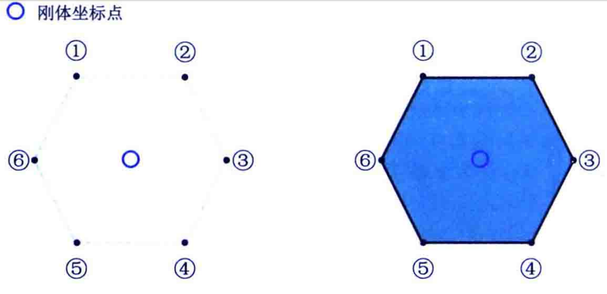
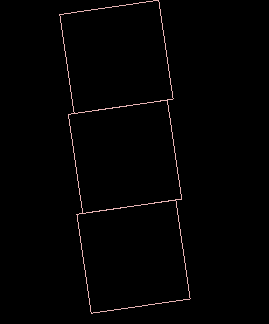
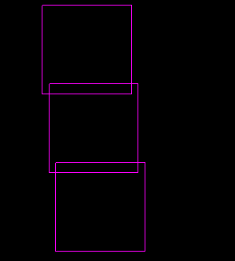

# Body

用来仿真各种物体（类似与精灵），物体的原型

## 定义

包含坐标 角度 受力 速度 质量等的一个东西  （万事万物皆刚体）

## 创建刚体

- BodyDef：创建定义的信息   （身份）
- FixtureDef ：物理信息   （皮囊）
- Body:目标

```java
BodyDef bodyDef = new BodyDef();bodyDef.type = BodyDef.BodyType.StaticBody;bodyDef.fixedRotation = false;
bodyDef.position.set(10,0);
Body body = Constant.world.createBody(bodyDef);
PolygonShape polygonShape = new PolygonShape();        polygonShape.setAsBox(100, 10);
FixtureDef fixtureDef = new FixtureDef();        fixtureDef.shape = polygonShape;
fixtureDef.density = 3;        fixtureDef.friction = 0.3F;
fixtureDef.restitution = 0.2F;
body.createFixture(fixtureDef);
```

### BodyDef

BodyDef bodyDef = new BodyDef();
bodyDef.active = false; //是否可用
bodyDef.allowSleep = true;  //允许睡眠
bodyDef.awake = true;
bodyDef.bullet = true ; //开始子弹高速 开启ccD碰撞检测
float angle = bodyDef.angle; // 角度
float angularDamping = bodyDef.angularDamping;
bodyDef.fixedRotation = true;

### fixtureDef

desity 
fricition
restitution
filter
isSensor
shape


### 创建

Body虽然有构造函数，但是不会使用。

```
protected final Pool<Body> freeBodies = new Pool<Body>(100, 200) {
    @Override
    protected Body newObject () {
        return new Body(World.this, 0);
    }
};

池中得到  设置参数
protected void reset (long addr) {
    this.addr = addr;
    this.userData = null;
    for (int i = 0; i < fixtures.size; i++)
        this.world.freeFixtures.free(fixtures.get(i));
    fixtures.clear();
    this.joints.clear();
}
```

没有形状的刚体无法模拟任何物理状态，fixtureDef只有绑定到body才可以使用。

一个刚体同时加入多个fixture

```
public Fixture createFixture (FixtureDef def) {
    long fixtureAddr = jniCreateFixture(addr, def.shape.addr, def.friction, def.restitution, def.density, def.isSensor,
        def.filter.categoryBits, def.filter.maskBits, def.filter.groupIndex);
    Fixture fixture = this.world.freeFixtures.obtain();
    fixture.reset(this, fixtureAddr);
    this.world.fixtures.put(fixture.addr, fixture);  
    this.fixtures.add(fixture);
    return fixture;
}
```

BodyDef是body所有属性的集合，私有的不公开的。创建结束之后就不会在有关系的，def可以重复使用

### 刚体形状

圆  矩形


### 绘制


## 源码

### 创建Body

- 准备BodyDef

```java
public Body createBody (BodyDef def) {
   long bodyAddr = jniCreateBody(addr, def.type.getValue(), def.position.x, def.position.y, def.angle, def.linearVelocity.x,
      def.linearVelocity.y, def.angularVelocity, def.linearDamping, def.angularDamping, def.allowSleep, def.awake,
      def.fixedRotation, def.bullet, def.active, def.gravityScale);
   Body body = freeBodies.obtain();
   body.reset(bodyAddr);
   this.bodies.put(body.addr, body);
   return body;
}
```

创建调用C，返回一个long值，从pool中得到body对象，设置值。   

Body的创建需要世界和一个ID。

```java
protected final Pool<Body> freeBodies = new Pool<Body>(100, 200) {
   @Override
   protected Body newObject () {
      return new Body(World.this, 0);
   }
};
```

rest的时候将fixture清除。  BodyDef不在使用。也不会进行保存。

**def**

一些基本的属性值。

### FixTureDef

这一部分值会存储，可以进行修改的。和皮囊有关管的比如摩檫力

**刚体形状**

- 方形
  - setAsBox

```java
PolygonShape polygonShape = new PolygonShape();
polygonShape.setAsBox(100, 10);
polygonShape.dispose();
```

他用来实现标准圆之外的所有形状，，包括矩形/三角形/梯形/扇形，以及不规则形状



绘制 : 需要保证顺时针   夹角小于180-

-  set

```
 PolygonShape polygonShape = new PolygonShape();
 Vector2[] a = new Vector2[3];
 a[0] = new Vector2(0,0);
 a[1] = new Vector2(10,10);
 a[2] = new Vector2(20,10);
 polygonShape.set(a);
```

- 圆

  ```
  CircleShape polygonShape = new CircleShape();
  polygonShape.setRadius(10);
  polygonShape.setPosition(new Vector2(10,10));
  ```


给夹具添加属性

```
fixtureDef.density = 3;
fixtureDef.friction = 0.3F;
fixtureDef.restitution = 0.2F;
```

- 创建夹具

  ```
  public Fixture createFixture (FixtureDef def) {
     long fixtureAddr = jniCreateFixture(addr, def.shape.addr, def.friction, def.restitution, def.density, def.isSensor,
        def.filter.categoryBits, def.filter.maskBits, def.filter.groupIndex);
     Fixture fixture = this.world.freeFixtures.obtain();
     fixture.reset(this, fixtureAddr);
     this.world.fixtures.put(fixture.addr, fixture);
     this.fixtures.add(fixture);
     return fixture;
  }
  ```

  也是通过c创建返回long值，通过pool创建fixture，然后设置long，将创建的夹具放到本地的body和世界的fixturelist中


## 创建案例


```
BodyDef bodyDef = new BodyDef();
bodyDef.type = BodyDef.BodyType.StaticBody;
bodyDef.fixedRotation = false;
bodyDef.position.set(10,0);
Body body = Constant.world.createBody(bodyDef);
CircleShape polygonShape = new CircleShape();
polygonShape.setRadius(10);
polygonShape.setPosition(new Vector2(10,10));
FixtureDef fixtureDef = new FixtureDef();
fixtureDef.shape = polygonShape;
fixtureDef.density = 3;
fixtureDef.friction = 0.3F;
fixtureDef.restitution = 0.2F;
body.createFixture(fixtureDef);
polygonSh
ape.dispose();
```


## Debug

```
Constant.renderer = renderer = new Box2DDebugRenderer(true,true,true,true,true,true);
```

- 仅仅绘制刚体

  

  

- 只绘制AABB

  

-   drawInactiveBodies只绘制不活波的

  

-  drawVelocities绘制速度

-  contacts 

只看到两个效果，其他的很没有看到什么效果


## 刚体类型


静态就呆呆地在哪里，不进行任何的物理模拟

动态刚体:不进行任何模拟，但是可以有自己的加速度，一般可以作为游戏里面的起重机效果，比如电梯

动态刚体


**注意：**

bullet它是对刚体有作用效果。


