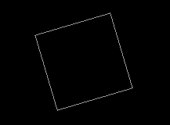
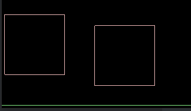

# 刚体属性

**状态**

- active：刚体可用？
  - 默认为true
  - false:执行step()时物理模拟计算直接跳过
  - 设置为true,所有属性恢复原来值，参数模拟
  - 物体超出屏幕可以设置false
  - 读写：is / setxx();
- 
  - 
  
- allowSleep:允许睡眠？
  
  - 针对当前刚体和dosleep存在区别   dpsleep对所有的刚体
  
- awake:活动与否？
  
  - 静止下来就会变为false     发生碰撞就会变为true(box2d会自动设置)
  
  
  
  什么也看不到
  
- bullet:是否模拟高速子弹
  - 需要对出现穿透设置的，运算开销大
  - 对静态物体是没有作用的，可以穿过其他物体

awake 和 active是区别， 一个是不模拟，一个是不活跃，停止下来的一种状态。

睡眠：当运动停止下来就变为睡眠，不允许睡眠，停下来了也不会不活跃，一直保持活跃状态


**角度 角速度**

- angle：刚体角度
  - 弧度值 1弧度 = 180 / Math.PI度                                libGdx中没有
- angularDamping：旋转角速度阻尼
- angularVelocity：旋转角速度
  - 弧度
- fixedRotation：是否禁止旋转
- inertiaScale：刚体角速度惯性系数

··坐标 速度··

linearDamping：线性速度阻尼

使用:一般在飞行过程中，不受其他摩檫力，但是为了使得可以停止，可以设置线性阻尼，比如模拟空气阻力

```
for (int i = 0; i < 2; i++) {
    bodyDef.position.set(6+30*i,30);
    Body body = Constant.world.createBody(bodyDef);
    body.createFixture(fixtureDef);
    if (i%2 == 0)
    body.setLinearDamping(0.4F);
}
```

```
body.setLinearDamping(10);
```



linearVecity：线性速度

```
body.setLinearVelocity(new Vector2(10,0));
```

position：刚体坐标

··其他属性··

type：刚体类型
userData：自定义属性