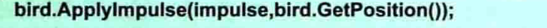
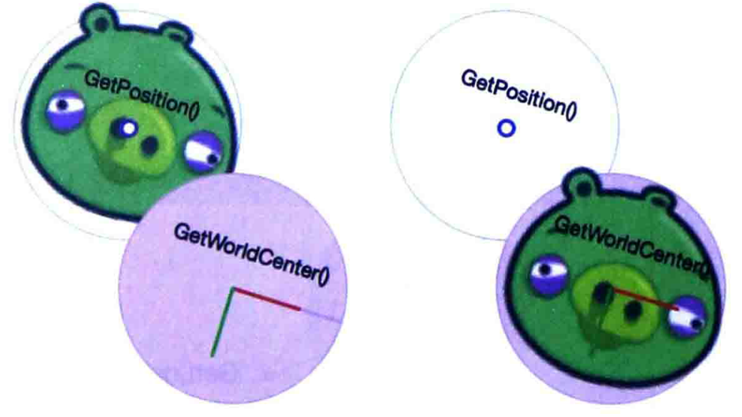
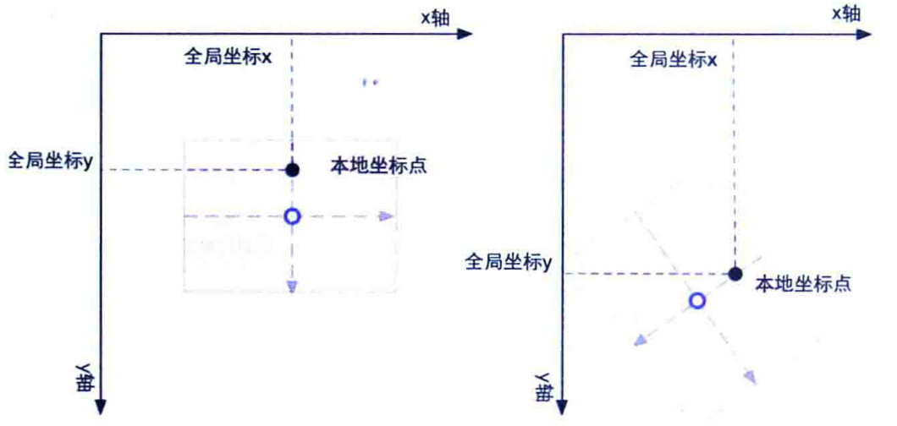
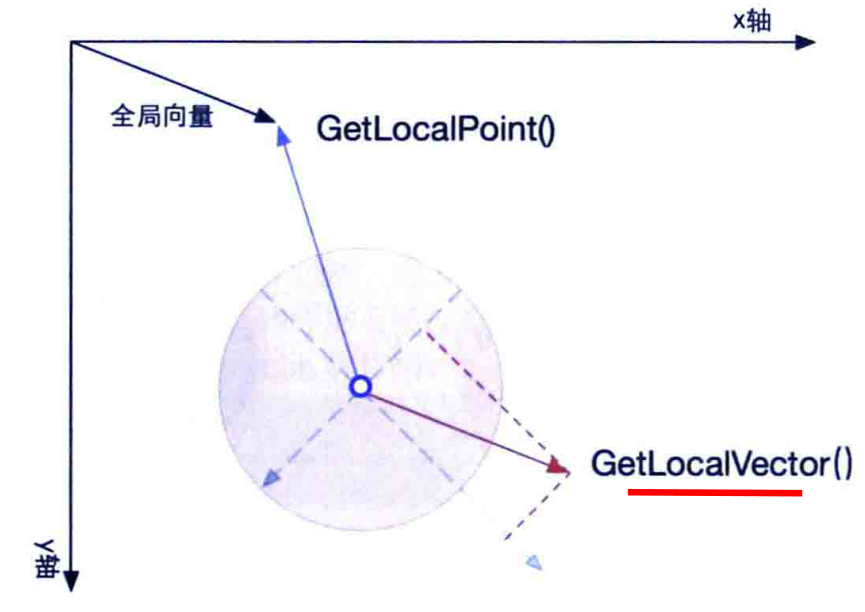
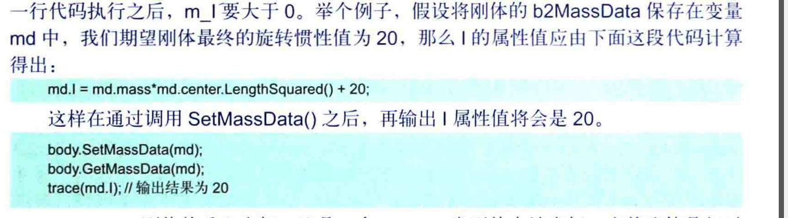
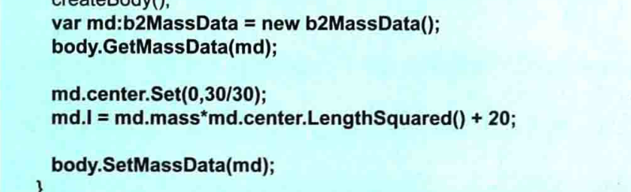
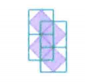
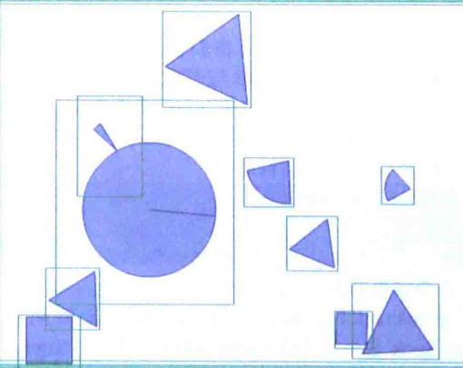
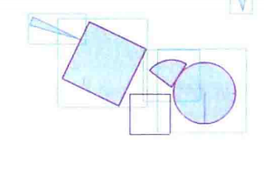
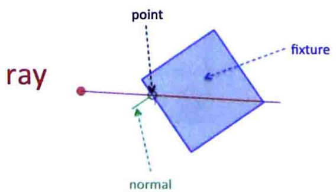

## 刚体操作


- [刚体操作](#----)
- [ApplyForce](#applyforce)
- [ApplyImpulse](#applyimpulse)
- [ApplyTorque](#applytorque)
- [GetLocalXX  GetWorldXX](#getlocalxx--getworldxx)
    + [坐标](#--)
- [向量](#--)
- [消除重力](#----)
- [setMassData](#setmassdata)
- [DestoryFixture将刚体销毁](#destoryfixture-----)
- [Split](#split)
- [GetAABB](#getaabb)
- [QueryAABB](#queryaabb)
    + [使用场景：](#-----)
  * [参数说明](#----)
- [射线](#--)
  * [参数](#--)
- [QueryShape](#queryshape)
- [可动刚体](#----)
- [形状](#--)

<small><i><a href='http://ecotrust-canada.github.io/markdown-toc/'>Table of contents generated with markdown-toc</a></i></small>


## ApplyForce

施加作用力是改变运动状态的唯一方法

ApplyForce:

- force:需要施加的力    受力之后变为加速度    force的属性值，可以通过期望值计算

  ```java
  F = ma;
  ```

- point：作用力施加在刚体坐标位置   全局坐标，如果位置与刚体中心全局坐标不相符合，会导致刚体角度发生变化。一般可以通过

  ```java
  getWorldCenter()得到刚体的全局坐标/
  ```

  他使得刚体速度发生循序渐进的变化，不适宜做弹射速度发生极大变化的

- 作用力与刚体的运动方向不一致的时候，会导致运动方向发生变化

  ```ava
  力的计算方式
  Vector2 force = new Vector2(0,0);
  force.x = -bird.getMass()*1;   ma
  ```

- 施加力不是一瞬间的事情，他是一个持续的过程

**body属性**

保存刚体所受的力，会重新计算线速度，力会进行叠加。如果不需要添加，那么就清楚之前的力

```jaba
clearForce
```


## ApplyImpulse

冲量，force力特别大也是可以模拟的


I = ,mv       原点 




## ApplyTorque 

z轴旋转力   旋转刚体

```java
  private Body body;
    public Demo03(){
        com.kangwang.world.Box2DFactory factory = new Box2DFactory();
        factory.setSize(Constant.width, 1);
        factory.setDensity(0.5F);
        factory.setFriction(0.4F);
        Body body1 = factory.getBody();
        factory.reset();
        BodyDef bodyDef = new BodyDef();
//        bodyDef.active = false; //是否可用
//        bodyDef.allowSleep = true;  //允许睡眠
        bodyDef.awake = true;
        bodyDef.bullet = true ; //开始子弹高速 开启ccD碰撞检测
        float angle = bodyDef.angle; // 角度
        float angularDamping = bodyDef.angularDamping;
        bodyDef.fixedRotation = true;
        bodyDef.type = BodyDef.BodyType.DynamicBody;
        bodyDef.fixedRotation = false;
        bodyDef.position.set(10,70);
        this.body = Constant.world.createBody(bodyDef);
        PolygonShape polygonShape = new PolygonShape();
        polygonShape.setAsBox(3, 3);
        FixtureDef fixtureDef = new FixtureDef();
        fixtureDef.shape = polygonShape;
        fixtureDef.density = 1;
//        fixtureDef.friction = 0.2F;
        fixtureDef.restitution = 0.3F;
        this.body.createFixture(fixtureDef);
        polygonShape.dispose();

        this.body.isActive();
        this.body.setActive(true);

//        WheelJointDef def = new WheelJointDef();
//        def.initialize(body1,body,new Vector2(10,70),
//                new Vector2(0,1));
//        def.enableMotor = true;
//        def.motorSpeed = 100;
//        def.maxMotorTorque = 10;
//        Constant.world.createJoint(def);


        Vector2 worldCenter = body1.getWorldCenter();
        //世界远点的位置
        Vector2 position = body1.getPosition();
    }

    @Override
    public void act(float delta) {
        super.act(delta);
//        body.getWorldVector(new Vector2(1.5F,1.5F))
        Constant.world.clearForces();
        body.applyTorque(400,true);
    }
}
```

## GetLocalXX  GetWorldXX

实现本地坐标  全局坐标  向量之间的转换

#### 坐标

- getLocalCenter ：重心的本地坐标
- getWorldCenter：中心的世界坐标
- getLocalPoint(WorldPoint)：获取全局坐标在坐标系的本地坐标
- getWorldPoint(localPoint)：本地坐标在舞台中的全局坐标

## 向量

-  getLocalVector（worl dV）:全局向量在坐标系统中的本地向量
- getWorldVector(localV)：本地在物体中的全局向量


**原点  和  质心**

原点：getWorldCenter    getLocalCenter得到重心   不规则的原点和重心不在一起    原点getPosition

可以计算偏差。


刚体的旋转是通过重心来完成的

- 对于贴图里面，按照重心会更好一点

  

- getWordPint()和getLocalPint

  本地  -----  全局

  ApplyForce作用力，需要设定在全局坐标点，刚体运动的，固定坐标就不合适了

  

- getWorldVector   getLocalVector

  转换的直接 效果：向量从全局坐标原点偏移到了刚体的坐标位置

  

- getMass得到质量

## 消除重力

- 得到重力加速度
- 反向
- mg

## setMassData

box2d没有设定质量和旋转惯性，而是集成在massdata中

```java
质量   重心坐标   冲量
public class MassData {
   /** The mass of the shape, usually in kilograms. **/
   public float mass;

   /** The position of the shape's centroid relative to the shape's origin. **/
   public final Vector2 center = new Vector2();

   /** The rotational inertia of the shape about the local origin. **/
   public float I;
}
```

mass值不建议修改，质量是求出来的，修改会影响模拟效果     也会影响惯性

I :旋转惯性 ：值越大保持的惯性就越大，角度上的变化就越慢   我i们设置惯性，依然不是最终结果值  他虚脱通过计算




- center:重心的位置：他说本地坐标  相对于本地坐标的原点，修改重心实现偏心圆的效果

可以通过ResetMassData将值恢复为计算值

修改重心



## DestoryFixture将刚体销毁


## Split

举例：游戏中物体不会凭空消失，他会经过一个过程消失掉。

split:可以将刚体的符合条件的Fixture分离，添加到body里面，形成独立的刚体


:earth_asia:  只有as有


## GetAABB

当前范围的最小矩形  左上角  右下角  平行于坐标轴的包围盒子。

确定矩形的方式：

- 左上右下
- 开始位置+长宽

java没有AABB，但是可以自己计算出来

```java
矩形：坐标位置 + 宽 + 高

圆：位置  + 半径 求出
```

AABB作用：判断刚体的最高点等



## QueryAABB

并不会仅仅的包围




它的作用是：形状和位置角度有细微变化到时候，如果还在扩充 的范围内就不会重新的的增加新的碰撞检测。

他会查找world中任何一个存在碰撞风险的



他们进行碰撞之后，如果在潜在碰撞范围内发生重叠，他就成为QAABB的查找对象

#### 使用场景：

```
world.QueryAABB(queryCallback, j + 0.2f, i + 0.2f, j + 0.8f, i + 0.8f);
```

```
QueryCallback queryCallback = new QueryCallback() {
    @Override
    public boolean reportFixture(Fixture fixture) {
        wall = fixture.getFilterData().categoryBits == Constant.WALL_BIT;
        return false; // stop finding other fixtures in the query area
    }
};
```

在地图中查找有没有范围内重叠的，出现墙就标记为墙

可以理解为对指定的区域进行迷糊查找。

### 参数说明

callback:遍历刚体时的回调函数，会查找潜在区域中的Fixture对象，作为参数给回调。对于回调函数的返回值，他表示是否继续进行查找

- true：继续进行查找
- false:立即停止查找

```actionScript
function QueryAABB{
	callback : Function,
	aabb:b2AABB
}
```

第二个参数aabb查找范围内的对象，libGdx版本

```
      addListener(new ClickListener(){
            @Override
            public void clicked(InputEvent event, float x, float y) {
                super.clicked(event, x, y);
//              点击任意地方消失
//                if (box == null)return;
//                Constant.world.destroyBody(box);
//                box = null;
//                System.out.println("======>>>>>>>>>>>>>");


//                点击销毁指定的
                System.out.println("==>>>>");
                Constant.world.QueryAABB(callback,x-10,y-10,x+10,y+10);
            }
        });
```

指定范围内的，他一共有5个参数。第一个回调，后面送个时画矩形。

## 射线

返回一条射线，这个射线上所有的fixture，简单说，以条线段，这个线段里面遇到了谁

```java
private RayCastCallback castCallback = new RayCastCallback() {
    @Override
    public float reportRayFixture(Fixture fixture, Vector2 point, Vector2 normal, float fraction) {
        if (fixture.getFilterData().categoryBits == Constant.WALL_BIT) {
            hitWall = true;
        }
        return 0;
    }
};
```

```java
world.rayCast(castCallback,tmpV1,tmpV2);
```

从开始位置发送射线。

### 参数

**回调参数**

- callback:检测到存在碰撞的时候就会调用，将信息传给callback      返回值，表示碰撞的状态和过程
- 参数一：表示开始的点
- 参数二：表示结束的点

**函数的参数**

- fixture:与线段发生碰撞的夹具
- point:碰撞点的坐标，全局坐标   一般是靠近起始点的那个点
- normal:垂直交叉边的
- fraction:碰撞点到起始点 / 总长




## QueryShape

只使用于as  js版本中。

## 可动刚体

碰撞没有什么效果，但是他是可动的


## 形状

CircleShape 和 PolygonShape 
还有EdgeShape和chainShape用来创建一个或者多个线段

CircleShape标准圆 
- getLocalPosition 本地坐标


