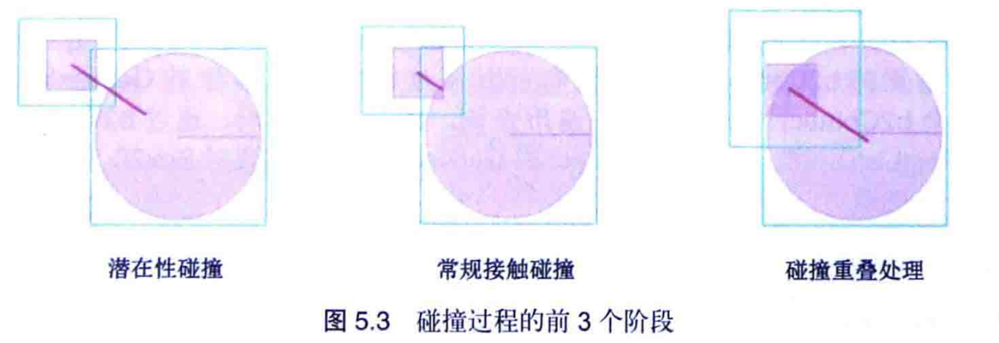
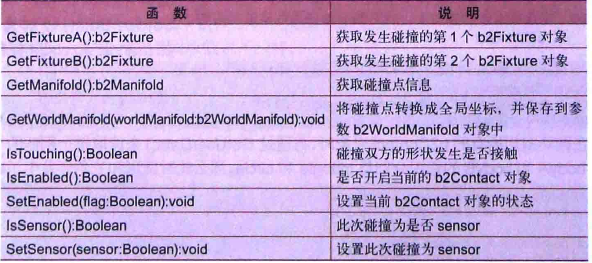
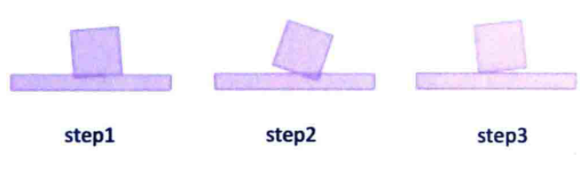
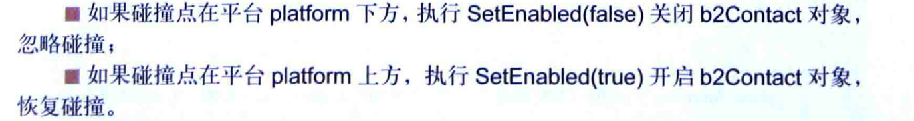
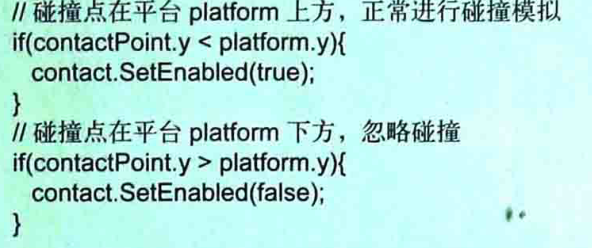

# 碰撞

[TOC]

box2D碰撞可以实现碰撞检测，实现反弹/变向等碰撞模拟。碰撞之后如何处理，比如粘贴，消失等，或者碰撞点的发一些特效。

潜在碰撞：最小包围盒发生接触或者重叠，引发的碰撞

## 什么是碰撞

两个接触或者部分重叠，box2d分为两种一种是形状发生的重叠接触，另一种是最小包围盒发生的接触和重叠，所引发的碰撞。QueryAABB和FattenAABB，后者的范围要大，不需要考虑形状。




碰撞结束之后的处理。

- 一种是获得Contact列表 
- ContactListener

### ContactList()获取列表

得到的是Contact列表，但是需要区分World中的ContactList()和body中的ContactList()

### ContactListener

没有事件处理委派机制，仅仅提供一些函数，分别表示碰撞的不同阶段，Contact表示当前处理函数的对象。

一般常用的是这个监听函数。

我们可以通过Contact对其 做一些操作，比如规避碰撞或者是对碰撞做一些操作（恢复）。

Contact的生命周期：从开始潜在碰撞开始，一直到最小包围盒不在重叠 销毁



碰撞发生之后，我们只能看到


## FixtureA和FixtureB

返回两个碰撞形状的对应的对象。但是我们顺利获取碰撞对象。AB无法区分信息，我们可以使用setUserData()添加信息，

```java
public void beginContact(Contact contact) {
    System.out.println("begin");
    System.out.println("contact.getFixtureA()"+contact.getFixtureA().getBody().getUserData());
    System.out.println("contact.getFixtureB()"+contact.getFixtureB().getBody().getUserData());
}
```


## getManiFold()

在libGdx是 没有提供它的API，下面案例是WorldManifold。

保存碰撞点信息，是本地系统坐标，用于内部优化使用，实际应用中都是用的是全局坐标，并设置一些碰撞效果。

```java
WorldManifold worldManifold1 = contact.getWorldManifold();
//碰撞点对应边对应的法向量
Vector2 normal = worldManifold.getNormal();
//碰撞点的坐标    是stage的坐标
Vector2[] points = worldManifold.getPoints();
//碰撞点鼠
int numberOfContactPoints = worldManifold.getNumberOfContactPoints();
```

## isTouching()

重叠为true  没有重叠为false;

```java
//是不是发生重叠   挨住
System.out.println(contact.isTouching());
```


## setEnable()和IsEnable()

游戏进行的某个时刻，不需要模拟，可以将设置able状态。false：关闭，忽略当前碰‘

这状态只会保持一个step(),所以需要长时间的，就需要持续设置。


但是这样也是不可以的，因为已经完成了 模拟。

正确的处理方式：

在b2ConListener中对象或者子类中preSovle函数调用setEnable()。

```
    //begin开始之后就执行   一直到不活跃
            @Override
            public void preSolve(Contact contact, Manifold oldManifold) {
                contact.setEnabled(false);
//                System.out.println("pre");
//                System.out.println();
            }
```

### step的执行过程

- contact开启
- presolve
- 碰撞模拟

所以在碰撞模拟之前就将其禁用了，进而就会忽略当前的碰撞。

setEnable只会就会不在派发postSolve事件。


## setSensor()

对象不会进行碰撞模拟，可以直接穿过。这是fixture,

bContact也有一个，可以在setSensor传入true，作为感应区，不会进行碰撞模拟


### setFriction

摩檫力，执行了这个方法之后，需要将数据恢复resetFriction()


### setTangenSpeed

碰撞时，在碰撞面的切线方向，为碰撞刚体添加一个线性速度speed，实现类似传送带的效果

##  碰撞侦听器

刚体碰撞可以发生多次的step操作，但是beginContact只会执行一次，endContact也是。

postSolve函数每次碰撞都会进行模拟，直到分离。在碰撞修复阶段执行（下图的三次）




preSolve：从两个形状AABB接触开始，到AABB分开，每次都会执行


## 参数

```java
public void preSolve(Contact contact, Manifold oldManifold)
Manifold:用来记录上一次物理模拟之前碰撞点信息
```

```java
public void postSolve(Contact contact, ContactImpulse impulse)
impulse：记录碰撞产生的冲量
```

```java
impulse.getNormalImpulses();  //垂直碰撞面
impulse.getTangentImpulses();  //平行碰撞面
```

## 游戏碰撞

### 万有引力

## 撞击伤害

撞击需要一次或者多次，撞击的时候会有一个垂直于碰撞边的冲量，保存在ContactImpulse中，将冲量作为撞击产生的伤害
并且值只会在恢复的时候产生。PostSolve

## 单边

比如向上跳跃没有任何影响，下落过程中可以接住下裸体




使用的位置，是模拟之前，postSolve是每次都进行调用的，所以在beginContact中使用，但是每次调用step的时候，会设置回去，所以需要修改源码，关闭Contact自动开启

## 碰撞粘贴

碰撞之后会粘贴在一起，一起运动


