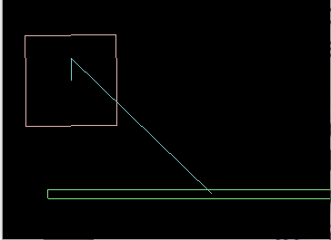
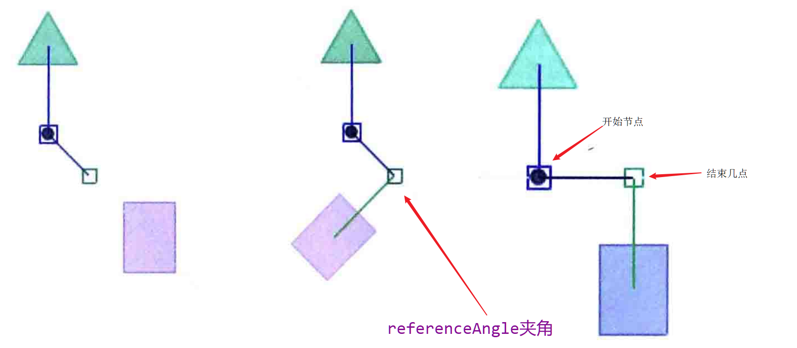
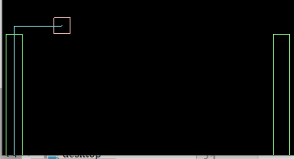
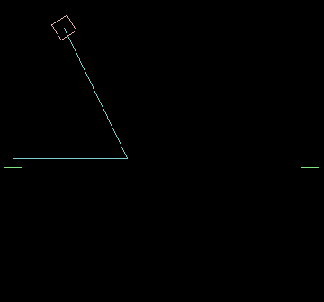
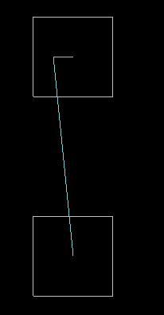
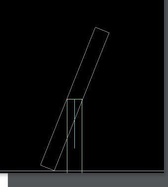
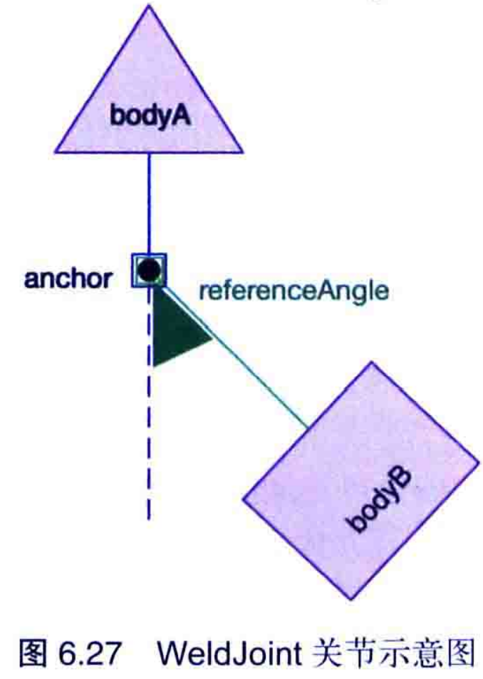
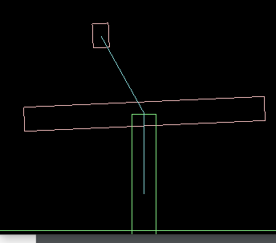

# 关节

box2d会通过关节将两个刚体绑在一起，使得两个刚体运动在关节的作用下相互制约相互影响形成有规律的运动。
box2Joint的创建方法

## 创建关节

```java
WeldJointDef def = new WeldJointDef();
Constant.world.createJoint(def);
```

使用子类进行创建。

- 创建def对象，通过设置属性进行创建

```
Body body1 = createBody(600);
Body body2 = createBody(0);
//关节
WeldJointDef def = new WeldJointDef();
def.collideConnected = false;
def.initialize(body1,body2,new Vector2(0,0));
Constant.world.createJoint(def);
```

### 说明

```
JointDef def = new MotorJointDef();
def.bodyA = box;
def.bodyB = box1;
def.collideConnected = true; // true / false  false:不发生碰撞，可以相互穿透
def.type = null;  //无需关心   自己会创建
```

必须要是他的子类

```
public Joint createJoint (JointDef def) {
long jointAddr = createProperJoint(def);
Joint joint = null;
if (def.type == JointType.DistanceJoint) joint = new DistanceJoint(this, jointAddr);
if (def.type == JointType.FrictionJoint) joint = new FrictionJoint(this, jointAddr);
if (def.type == JointType.GearJoint) joint = new GearJoint(this, jointAddr, ((GearJointDef) def).joint1, ((GearJointDef) def).joint2);
if (def.type == JointType.MotorJoint) joint = new MotorJoint(this, jointAddr);
if (def.type == JointType.MouseJoint) joint = new MouseJoint(this, jointAddr);
if (def.type == JointType.PrismaticJoint) joint = new PrismaticJoint(this, jointAddr);
if (def.type == JointType.PulleyJoint) joint = new PulleyJoint(this, jointAddr);
if (def.type == JointType.RevoluteJoint) joint = new RevoluteJoint(this, jointAddr);
if (def.type == JointType.RopeJoint) joint = new RopeJoint(this, jointAddr);
if (def.type == JointType.WeldJoint) joint = new WeldJoint(this, jointAddr);
if (def.type == JointType.WheelJoint) joint = new WheelJoint(this, jointAddr);
if (joint == null) throw new GdxRuntimeException("Unknown joint type: " + def.type); 
```

两个刚体保持一致,做某种运动   

```java
RevoluteJointDef def = new RevoluteJointDef();
def.initialize(box2DImage,body1,new Vector2(10,100));
Constant.world.createJoint(def);
```

说明：Joint and JointDef不会直接创建，它们是虚拟的抽象类，作为父类代码的多态和重构。

属性：

- BodyA
- BodyB
- CollideConnected:表示关节链接的两个物体之间是否可以发生碰撞模拟，默认为false,不发生碰撞，可以穿透 

### 案例

```java
public Demo01(){
    Utils utils = new Utils();
    Body box = utils.createBox(Constant.width/2 + 10, 10, Constant.width / 2, 1, true);
    box.setUserData("box1");
    Body box1 = utils.createBox(20, 40, 10, 10, false);
    box1.setUserData("box2");

    RevoluteJointDef def = new RevoluteJointDef();
    Vector2 position = box1.getPosition();
    position.x = position.x - 5;
    def.initialize(box,box1,box.getWorldVector(position));
    Constant.world.createJoint(def);
}
```



- enableMotor：是否开启马达属性  默认false
- motorSpeed：在刚体运懂情况下，可以到达的最大线速度和最大角速度。
- maxMotorTorque:关节可以施加最大的力。

这个过程中，刚体的角速度和线速度会一直增加，直到motorSpeed属性
另一个属性可以作为旋转摩檫力使用，设置motorspeed属性值为0，maxMotorTorque作用会阻止刚体在原来的状态，直到外力大于maxMotorToorque属性

弹簧属性：

- frequencyHz和damping属性，运行刚体在运动时偏离节点，偏移后会收到一个力，使得它可以回到原来的位置。所以这两个属性就会在影响它。
- frequencyHz:弹簧系统的震动频率，可以看作时弹簧的弹性系数，系数越大，回归的系数就越大。
- dempingRaio:刚体回归节点收到的阻尼，0~1，值越大，阻力越大。

不常使用的

- GetReactionForce()
- GetReactionTorque()

创建完成之后关节def就没啥关系了，可以修该属性继续使用。


## 常见关节


### DistanceJointDef

```
Body body1 = createBody(800);
Body body2 = createBody(188);
DistanceJointDef  jointDef = new DistanceJointDef();
jointDef.bodyA = body1;
jointDef.bodyB = body2;
jointDef.initialize(body1,body2,new Vector2(Constant.width/2-100,500),new Vector2(Constant.width/2,500));
```

这个可以用自行车的前后轮胎进行类比

### 关节的属性

- enableMotor：是否开启马达属性  默认false
- motorSpeed：在刚体运懂情况下，可以到达的最大线速度和最大角速度。
- maxMotorTorque:关节可以施加最大的力。

这个过程中，刚体的角速度和线速度会一直增加，直到motorSpeed属性
另一个属性可以作为旋转摩檫力使用，设置motorspeed属性值为0，maxMotorTorque作用会阻止刚体在原来的状态，直到外力大于maxMotorToorque属性

弹簧属性：

- frequencyHz和damping属性，运行刚体在运动时偏离节点，偏移后会收到一个力，使得它可以回到原来的位置。所以这两个属性就会在影响它。
- frequencyHz:弹簧系统的震动频率，可以看作时弹簧的弹性系数，系数越大，回归的系数就越大。
- dempingRaio:刚体回归节点收到的阻尼，0~1，值越大，阻力越大。

不常使用的

- GetReactionForce()
- GetReactionTorque()

## 鼠标关节

和鼠标是有关联的，可以实现鼠标的拖拽

- bodyA:一个空刚体
- bodyB:另一个
- target:创建关节时，target时bodyB被拖动收到前置的本地锚点，bodyB可以绕着旋转，他是目标位置，
- maxForce:鼠标关节拖拽bodyB时，施加最大的作用力

## PrismaticJointDef（位移节点）

```java
vector2 axis = new Vector2(6, 0);
//            axis.nor();
//bodyA 固定转轴
//bodyB 运动的
//开始位置
//方向    axis的值，确定了从开始到结束的夹角
pjd.initialize(ground, body, new Vector2(0, 0), axis);
pjd.motorSpeed = 10.0f;
pjd.maxMotorForce = 10000.0f;
pjd.enableMotor = true;
pjd.lowerTranslation = 0;
pjd.upperTranslation = 20.0f;
pjd.enableLimit = true;
m_joint = (PrismaticJoint)world.createJoint(pjd);
```

### 夹角的确定

axis点和anchor的夹角，作用只的大小没有太大意义的。

内部做了许多的计算 模拟  所以值比较大容易造成抖动

解决方法：将axis直接做成夹角就可以了 axis.nor();转换为向量。
夹角与固定的保持不变，也就是bodyA保持相对不变，bodyA变化了，夹角也会随着变化。

上面主要对角度进行了控制，下来我们对他的范围也进行控制，axis指定了角度，然后按照角度会不断的延申，为了不超出去

- enablLimit:对刚体移动范围是否进行约束，默认为false,true就表示将范围限制在
  
    - lowerTranslation
    - upperTranlation
    

要求：upper大于lower

- referenceAngle：角度差距，他的用法使用三张图来看

  


### 使用场景

固定路径，比如一个人从桥的这一头走到下一头。

### 案例



```
def.localAnchorA.set(4,32);  A的锚点
```


```
def.localAnchorB.set(4,32);
```



```
def.referenceAngle = 10;
```

锚点出的夹角


```
public class Game06 extends Group {
    private Utils utils;
    private Body box;
    public Game06(){
        setSize(Constant.width,Constant.hight);
        utils = new Utils();
        //base
        Body box = utils.createBox(3, 0, 2, 30, true);
        utils.createBox(Constant.width  - 3,0,2,30,true);
        Body box1 = utils.createBox(3, 32.1F, 2, 2, false);

        PrismaticJointDef def = new PrismaticJointDef();
        def.initialize(box,box1,new Vector2(3,32),new Vector2(1,0));
        def.enableLimit = true;
        def.lowerTranslation = 0;
        def.upperTranslation = 100;

        def.localAnchorB.set(3,32);
//        def.referenceAngle = 10;

        Constant.world.createJoint(def);
        box1.setLinearVelocity(new Vector2(5,0));
    }

    public void createBody(){
        //活动
        box = utils.createBox(Constant.width / 2 - 14, 20, 2, 2, false);
        box.setUserData("box");
    }

    @Override
    public void act(float delta) {
        super.act(delta);
        Constant.world.step(1/60F,40,40);
        Constant.renderer.render(Constant.world,Constant.combined);
    }
}
```

### 线性关节

LineJoint他是一个特殊的平行关节，他的特尔二叔之处就是可以绕着anchorB进行旋转。  


libGdx中没有

## RevoluteJoint(旋转关节)

旋转关节，可以看作一个轴，绕着轴旋转的车轮，这个关节 也有限制，比如最大角度，还有夹角。其次还有一些其他的函数。


- 角速度：JointSpeed
- 关节的旋转角：JointAngle
- 当前关节的扭矩力：MotorTorque

通过限制，可以做成跷跷板

## 案例




绕着一个点做运动，它可以设定旋转得范围。


### 作用

可以在游戏里面作为车轮。

跷跷板

```
setSize(Constant.width,Constant.hight);
utils = new Utils();
//base
utils.createBox(33, 0, Constant.width, 1, true);
body = utils.createBox(Constant.width / 2,10,3,20,true);
box1 = utils.createBox(Constant.width / 2,30,30,3,false);

RevoluteJointDef def = new RevoluteJointDef();
def.initialize(body,box1,new Vector2(box1.getPosition()));
Constant.world.createJoint(def);

utils.createBox(Constant.width / 2 - 10,50,2,3,false);
```



## DistanceJoint

距离关节：包含两个节点，分别对应两个刚体，使得各自绕着各自的轴转动，这个两个的距离不变

对两个刚体进行

## WeldJoint粘贴关节

将两个刚体，连接成一个刚体。这个节点就是将它们死死的连接在一起。两个刚体是一样的，但是受到节点限制，使得两个保持不变，看起来像一个整体，如果将节点删除，会将两个分开。分别各自的速度，角速度。



### 使用

那个一个圆旋转的游戏就可以使用它。




其实这样更好理解吧，可以理解为在下面长方体上有安装了一个东西，  其杆子上的红旗。

```
utils = new Utils();
//base
utils.createBox(33, 0, Constant.width, 1, true);
body = utils.createBox(Constant.width / 2,10,3,20,true);
box1 = utils.createBox(Constant.width / 2,30,30,3,false);

RevoluteJointDef def = new RevoluteJointDef();
def.initialize(body,box1,new Vector2(box1.getPosition()));
Constant.world.createJoint(def);

box2 = utils.createBox(Constant.width / 2 - 10,50,2,3,false);
WeldJointDef def1 = new WeldJointDef();
def1.initialize(box1,box2,new Vector2(box2.getPosition()));
Constant.world.createJoint(def1);
```

## 滑轮节点

滑轮作用：牵引负载   改变施加力  方向

这个完全蒙蔽

```
        setSize(Constant.width,Constant.hight);
        utils = new Utils();
        //base
//        Body box = utils.createBox(3, 50, 1, 1, true);

        Body box1 = utils.createBox(3, 50, 1, 1, false);

        Body box2 = utils.createBox(10, 50, 1, 2, false);

//        Body box3 = utils.createBox(3, 50, 1, 1, true);
//
//        Body box4 = utils.createBox(3, 50, 1, 1, true);


        PulleyJointDef def = new PulleyJointDef();
        def.initialize(box1,box2,
                box1.getWorldVector(new Vector2(box1.getPosition().x ,box1.getPosition().y+10))
                ,box2.getWorldVector(new Vector2(box2.getPosition().x ,box2.getPosition().y+10)),

                box1.getWorldVector(new Vector2(box1.getPosition().x ,box1.getPosition().y+70))
                ,box2.getWorldVector(new Vector2(box2.getPosition().x ,box2.getPosition().y+70)),

                30


                );
        Constant.world.createJoint(def);
```


## 柔体实现

weldJoint来实现

```
separator = new B2DSeparator();
Utils utils = new Utils();
Body box = utils.createBox(20, 0, 20, 2, true);
Array<Body> array = new Array<>();
for (int i = 0; i < 10; i++) {
    Body box1 = utils.createBox(10 + i * 5, 26+i*2, 2, 2, false);
    array.add(box1);
}
Body tem = null;
for (Body body : array) {
    if (tem == null){
        tem = body;
        continue;
    }
    WeldJointDef def = new WeldJointDef();
    Vector2 position = tem.getPosition();
    position.x=position.x + 6;
    def.frequencyHz = 30;
    def.dampingRatio = 0.3F;
    def.initialize(body,tem,tem.getPosition());
    Constant.world.createJoint(def);
    tem = body;
}
```

## 关节碰撞

实现思路，通过射线，得到碰撞点，使用关节模拟出绳子的效果。

绳子的长度知道，从开始到结束得到碰撞点，创建关节，

更新射线的起点，如果碰撞点不在碰撞，那么久删除节点，更新射线发出的位址。


